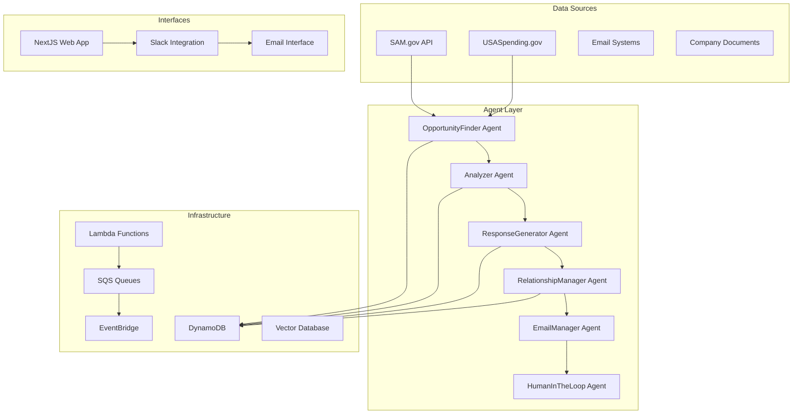

# Sources Sought AI - Multi-Agent Government Contracting Solution

A comprehensive, production-ready multi-agent system for automatically discovering, analyzing, and responding to government Sources Sought notices according to strategic contracting principles.

## Overview

Sources Sought notices are requests for information (RFI) posted by government agencies during early procurement stages to identify potential vendors, conduct market research, and shape requirements. This system provides automated intelligence gathering, response generation, and relationship management to maximize contracting success.

### Key Benefits

- **Early Positioning**: Get on government radar 12-18 months before contract award
- **Requirements Shaping**: Influence solicitations to favor your capabilities  
- **Competition Limiting**: Trigger small business set-asides through "Rule of Two"
- **Intelligence Gathering**: Learn needs not in final solicitations
- **Relationship Building**: Start crucial agency relationships early
- **Process Automation**: 75% reduction in response time with 100% compliance

## System Architecture

The system consists of specialized AI agents orchestrated through AWS services:



## Agent Specifications

### OpportunityFinder Agent (`ss-opportunity-finder`)
- **Purpose**: Continuous monitoring of SAM.gov for relevant Sources Sought notices
- **Capabilities**: 
  - Daily scanning with NAICS code filtering
  - Keyword matching and relevance scoring
  - Deadline tracking and alert generation
  - Market intelligence gathering
- **Triggers**: EventBridge daily schedule
- **Outputs**: Filtered opportunities to Analyzer Agent

### Analyzer Agent (`ss-analyzer`)
- **Purpose**: Deep analysis of Sources Sought requirements and strategic assessment
- **Capabilities**:
  - Requirements parsing and capability matching
  - Gap analysis and risk assessment
  - Competition analysis and positioning
  - Strategic recommendations generation
- **Triggers**: New opportunities from OpportunityFinder
- **Outputs**: Analysis report to ResponseGenerator

### ResponseGenerator Agent (`ss-response-generator`)
- **Purpose**: Automated generation of compliant, strategic responses
- **Capabilities**:
  - Template selection and customization
  - Past performance matching
  - Compliance verification
  - Strategic positioning and influence tactics
- **Triggers**: Approved analysis from Analyzer Agent
- **Outputs**: Draft response to HumanInTheLoop

### RelationshipManager Agent (`ss-relationship-manager`)
- **Purpose**: Tracking and nurturing government relationships
- **Capabilities**:
  - Contact database management
  - Communication history tracking
  - Engagement scoring and recommendations
  - Follow-up scheduling and automation
- **Triggers**: Response submissions and interactions
- **Outputs**: Relationship insights and action items

### EmailManager Agent (`ss-email-manager`)
- **Purpose**: Automated email processing and communication
- **Capabilities**:
  - Multi-template email generation
  - Inbox monitoring and response assessment
  - Confirmation tracking and follow-up
  - Human escalation for complex decisions
- **Triggers**: Various workflow stages
- **Outputs**: Sent emails and status updates

### HumanInTheLoop Agent (`ss-human-loop`)
- **Purpose**: Slack-based human interaction and approval workflows
- **Capabilities**:
  - Interactive approval interfaces
  - Document review and editing
  - Strategic decision support
  - Error escalation and resolution
- **Triggers**: Approval checkpoints and exceptions
- **Outputs**: Approved actions and feedback

## Technical Stack

### Backend Infrastructure
- **Language**: Python 3.11+
- **Compute**: AWS Lambda (serverless)
- **Database**: AWS DynamoDB (NoSQL)
- **Messaging**: AWS SQS (agent communication)
- **Scheduling**: AWS EventBridge (time-based triggers)
- **AI/ML**: AWS Bedrock (when cost-effective), OpenAI APIs
- **Search**: BM25 with preprocessed indices
- **Event Sourcing**: Immutable audit logs in DynamoDB

### Frontend Application
- **Framework**: Next.js 14+ with TypeScript
- **Authentication**: Google OAuth + additional providers
- **UI/UX**: Best-in-class design patterns
- **State Management**: Zustand or Redux Toolkit
- **Styling**: Tailwind CSS with shadcn/ui components

### Integrations
- **Slack**: Real-time notifications and approvals
- **Email**: Multi-provider support (Gmail, Outlook, etc.)
- **SAM.gov**: Official API integration
- **Model Context Protocol**: Tool and resource management

### DevOps & Monitoring
- **IaC**: AWS CDK/CloudFormation with proper tagging
- **Monitoring**: CloudWatch + 24/7 error alerting
- **Security**: IAM roles, encryption, compliance
- **CI/CD**: GitHub Actions with automated testing

## Resource Naming Convention

All AWS resources follow the pattern: `ss-{environment}-{service}-{component}`

Examples:
- `ss-prod-lambda-opportunity-finder`
- `ss-dev-dynamodb-opportunities`
- `ss-staging-sqs-analyzer-queue`

## Installation & Setup

### Prerequisites
- AWS CLI configured
- Node.js 18+
- Python 3.11+
- Docker (for local development)

### Quick Start
```bash
# Clone repository
git clone <repository-url>
cd sources-sought-ai

# Install dependencies
npm install
pip install -r requirements.txt

# Configure environment
cp .env.example .env
# Edit .env with your configurations

# Deploy infrastructure
npm run deploy:dev

# Start local development
npm run dev
```

### Environment Variables
```env
# AWS Configuration
AWS_REGION=us-east-1
AWS_ACCOUNT_ID=your-account-id

# API Keys
OPENAI_API_KEY=your-openai-key
SAM_GOV_API_KEY=your-sam-api-key
SLACK_BOT_TOKEN=your-slack-token

# Database
DYNAMODB_TABLE_PREFIX=ss-dev

# Authentication
GOOGLE_CLIENT_ID=your-google-client-id
GOOGLE_CLIENT_SECRET=your-google-client-secret
```

## Usage

### Initial Setup
1. **Company Profile**: Configure your company capabilities, certifications, and past performance
2. **Search Criteria**: Set NAICS codes, keywords, and geographic preferences
3. **Templates**: Customize response templates for different service types
4. **Contacts**: Import government contact database

### Automated Workflow
1. **Discovery**: OpportunityFinder monitors SAM.gov daily
2. **Analysis**: Analyzer evaluates fit and strategic value
3. **Review**: HumanInTheLoop presents recommendations via Slack
4. **Response**: ResponseGenerator creates tailored responses
5. **Submission**: EmailManager handles delivery and confirmation
6. **Follow-up**: RelationshipManager tracks ongoing engagement

### Manual Operations
- Override automated decisions
- Add custom analysis notes
- Schedule strategic meetings
- Export reports and analytics

## API Documentation

### Agent Endpoints
- `POST /api/agents/opportunity-finder/trigger` - Manual opportunity scan
- `GET /api/agents/analyzer/status/{opportunity_id}` - Analysis status
- `POST /api/agents/response-generator/generate` - Generate response
- `GET /api/agents/relationship-manager/contacts` - Contact management

### Webhook Endpoints
- `POST /webhooks/slack/events` - Slack event handling
- `POST /webhooks/email/inbound` - Email processing
- `POST /webhooks/sam-gov/updates` - SAM.gov notifications

## Data Models

### Core Entities
- **Opportunity**: Sources Sought notice with metadata
- **Company**: Business profile and capabilities
- **Response**: Generated submissions and status
- **Contact**: Government personnel relationships
- **Event**: Immutable audit trail

### Database Schema
See `docs/database-schema.md` for detailed table structures and relationships.

## Security & Compliance

### Data Protection
- Encryption at rest and in transit
- Role-based access control (RBAC)
- Audit logging for all operations
- PII handling compliance

### Government Regulations
- FAR compliance verification
- Conflict of interest monitoring
- Documentation retention policies
- Security clearance integration

## Monitoring & Alerts

### 24/7 Monitoring
- System health dashboards
- Performance metrics tracking
- Error rate alerting
- Cost optimization monitoring

### Business Metrics
- Opportunity discovery rate
- Response quality scores
- Win rate improvement
- ROI tracking

## Development

### Contributing
1. Create feature branch from `main`
2. Follow conventional commit messages
3. Add tests for new functionality
4. Update documentation
5. Submit pull request

### Testing
```bash
# Unit tests
npm run test:unit

# Integration tests
npm run test:integration

# End-to-end tests
npm run test:e2e

# Load testing
npm run test:load
```

### Code Quality
- ESLint + Prettier for JavaScript/TypeScript
- Black + isort for Python
- Pre-commit hooks for formatting
- SonarQube for quality analysis

## Deployment

### Infrastructure as Code
```bash
# Development environment
npm run deploy:dev

# Staging environment
npm run deploy:staging

# Production environment
npm run deploy:prod
```

### CI/CD Pipeline
- Automated testing on all PRs
- Staging deployment on merge to `develop`
- Production deployment on release tags
- Rollback capabilities

## Cost Optimization

### AWS Services
- Lambda: Pay-per-execution model
- DynamoDB: On-demand billing
- SQS: Minimal message costs
- EventBridge: Rule-based pricing

### AI/ML Costs
- Prefer smaller models for routine tasks
- Cache responses where appropriate
- Use AWS Bedrock only when cost-effective
- Monitor token usage and optimize prompts

## Support & Maintenance

### Documentation
- Architecture decision records (ADRs)
- API documentation with examples
- Troubleshooting guides
- Performance optimization tips

### Monitoring
- Real-time system status dashboard
- Performance metrics and trends
- Error tracking and resolution
- Cost analysis and optimization

## Roadmap

### Phase 1: Foundation (Weeks 1-4)
- Core agent implementation
- Basic AWS infrastructure
- SAM.gov integration
- Simple response generation

### Phase 2: Intelligence (Weeks 5-8)
- Advanced analysis capabilities
- Vector search implementation
- Relationship tracking
- Email automation

### Phase 3: Automation (Weeks 9-12)
- Slack integration
- Workflow automation
- Quality scoring
- Performance optimization

### Phase 4: Advanced Features (Weeks 13-16)
- Machine learning enhancements
- Predictive analytics
- Advanced relationship mapping
- Enterprise features

## Additional Capabilities

Based on the specifications and industry best practices, here are recommended additional capabilities:

### Enhanced Intelligence
- **Competitor Analysis**: Track competitor wins and strategies
- **Market Trend Analysis**: Identify emerging opportunity patterns
- **Pricing Intelligence**: Historical contract value analysis
- **Agency Behavior Modeling**: Predict agency preferences and timing

### Advanced Automation
- **Document Version Control**: Track response iterations and approvals
- **Team Collaboration**: Multi-user editing and review workflows
- **Compliance Verification**: Automated FAR regulation checking
- **Performance Analytics**: Win rate correlation analysis

### Integration Enhancements
- **CRM Integration**: Salesforce, HubSpot connectivity
- **Calendar Management**: Automated meeting scheduling
- **Proposal Management**: Bridge to full proposal systems
- **Financial Integration**: Cost tracking and ROI analysis

### AI/ML Enhancements
- **Custom Models**: Fine-tuned models for government language
- **Predictive Scoring**: AI-powered win probability assessment
- **Natural Language Processing**: Advanced requirement extraction
- **Sentiment Analysis**: Government communication tone analysis

## License

MIT License - See LICENSE file for details

## Contact

For questions, issues, or contributions:
- GitHub Issues: [Project Issues](./issues)
- Documentation: [Wiki](./wiki)
- Security: security@company.com